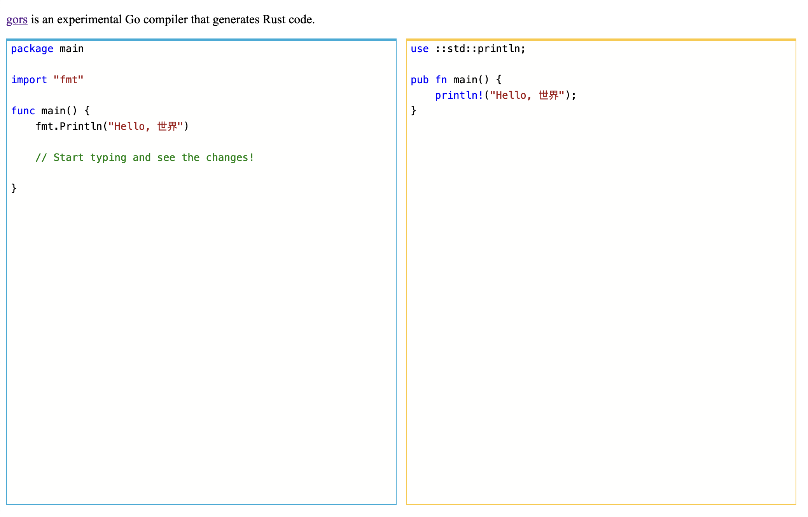

I like to play at the intersection of several languages. I always find it
interesting to push the limits of my knowledge and put myself in a situation
where I'm not really sure what's happening or how it's implemented.

[Gors](https://github.com/aymericbeaumet/gors) is exactly this: improve my
knowledge of the Rust language by implementing a basic Go lexer, parser and
compiler. You can play with it in this
[experimental editor](https://aymericbeaumet.github.io/gors/).
